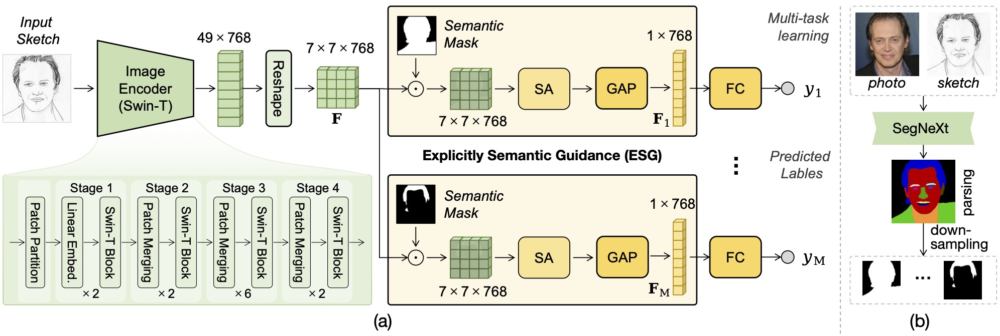
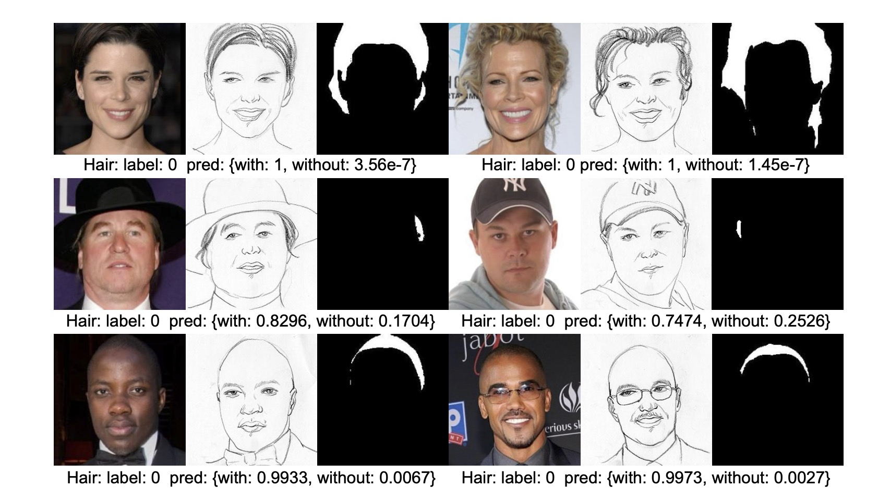
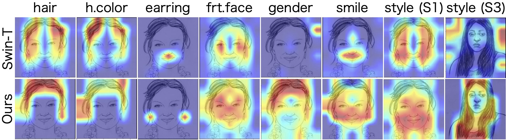

# ESGAR: Explicitly Semantic Guided Attribute Recognition

## Paper Information
Shahadat Shahed \*, Yuhao Lin \*, Jiangnan Hong, Jinglin Zhou, and Fei Gao†, Explicitly Semantic Guidance for Face Sketch Attribute Recognition with Imbalanced Data, IEEE Signal Processing Letters, 1502-1506, Oct. 13, 2023. 
[[Paper IEEE](https://ieeexplore.ieee.org/abstract/document/10285009/)] (\* denotes equal contributions; † Corresponding author.)

利用人脸分割 mask，指导人脸属性预测，提升模型的预测精度和可解释性

BibTeX
```[bib]
@article{shahed2023explicitly,
  title={Explicitly Semantic Guidance for Face Sketch Attribute Recognition With Imbalanced Data},
  author={Shahed, Shahadat and Lin, Yuhao and Hong, Jiangnan and Zhou, Jinglin and Gao, Fei},
  journal={IEEE Signal Processing Letters},
  pages={1502-1506},
  year={2023},
  publisher={IEEE}
}
```


## Abstract
Current facial attribute recognition (FAR) methods focus exclusively on photographs, and fail when applied to face sketches. Besides, face sketch attribute recognition (FSAR) encounters the following difficulties: the scarcity of labelled instances, the heavily imbalanced data distribution, and the inter-attribute correlations. To combat this challenge, in this paper, we propose a novel FSAR method based on the correlations between facial attributes and semantic regions. Our full model includes a shared feature extraction network, followed by several attribute-specific prediction branches. In each branch, we use the corresponding semantic mask, to select features from the associated region, for attribute prediction. Such explicitly semantic guidance (ESG) reduces the learning space, and thus alleviates the problems of limited data and imbalanced distribution. Besides, ESG decouples inter-attribute correlations, and makes the recognition process credible. Finally, we adopt the balanced cross-entropy loss during training, which further alleviates the problem of imbalanced data distribution. Experiments on the benchmark FS2K dataset demonstrate that our method significantly outperforms advanced visual recognition networks. Our codes have been released at: https://github.com/AiArt-HDU/ESGAR.

## Pipeline




## Examples




## Attention Visualization


